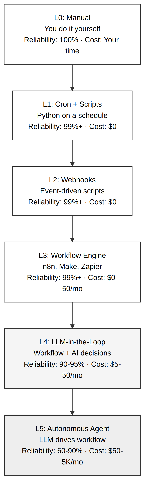
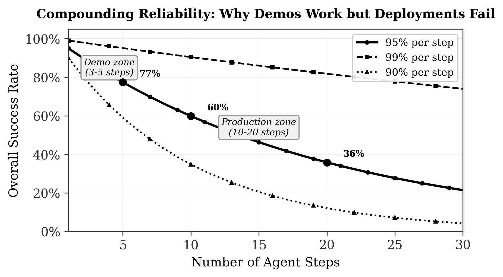
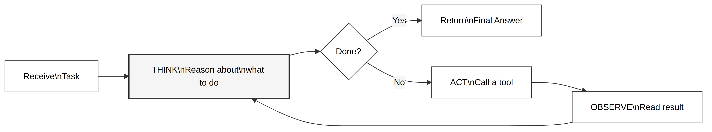
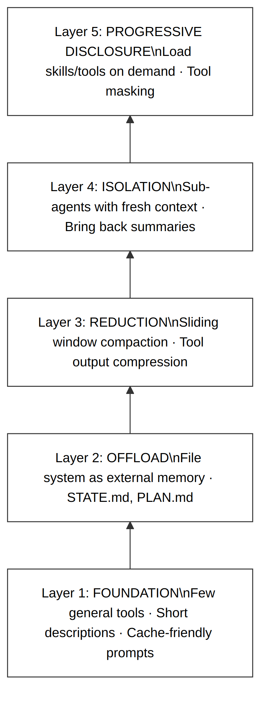
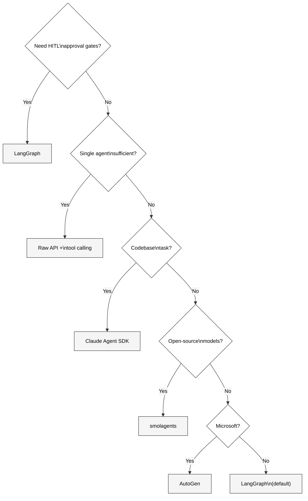

# Abstract {.unnumbered}

AI agents — software systems where a large language model dynamically decides what actions to take rather than following a predetermined script — have become one of the most discussed topics in software engineering. The promise is compelling: autonomous systems that can research, code, analyze, and coordinate complex tasks with minimal human oversight. The reality, as of early 2026, is more nuanced. Ninety-five percent of enterprise AI pilots fail to reach production. Multi-agent systems see 40% pilot failure rates within six months. A single runaway agent generated a $47,000 API bill over eleven days before anyone noticed.

This manual is a practitioner's guide to building AI agents that actually work. It synthesizes findings from over fifty research papers, fourteen original research reports, six production codebases, and three years of collective deployment experience. The document covers the full lifecycle: from deciding whether you need an agent at all, through architecture selection, context management, multi-agent coordination, evaluation, and production deployment. Each chapter builds on a single running example — a literature research agent that starts as a twenty-line script and evolves, chapter by chapter, into a production-grade system with evaluation, memory, and human oversight.

The manual's central argument is that the scaffolding around the model — the tools, the context management, the evaluation infrastructure, the safety controls — provides roughly eighty percent of the value in any agent system. The model itself provides twenty percent. Most failures come not from model limitations but from architectural decisions: too many tools, too little evaluation, no cost controls, and insufficient human oversight at critical decision points.

---


# Introduction

Imagine you ask an AI system to research a topic and write a summary. In a traditional setup, you would write a prompt, send it to a language model, and receive a response. The system does one thing: it generates text based on your input. If the response is incomplete or wrong, you refine your prompt and try again. The human drives the process.

Now imagine a different system. You give it the same research task, but instead of generating a single response, it begins to *act*. It searches the web for relevant papers. It reads them. It decides that three of the five papers are not relevant and discards them. It notices a gap in its understanding and searches again with different terms. It drafts a summary, reviews its own draft, identifies a factual error, goes back to the source to verify, corrects the error, and presents the final result. The system drove the process. You provided the goal; it decided the steps.

The first system is a language model. The second is an agent.

This distinction — between systems where humans decide the control flow and systems where the model decides — is the foundation of everything in this manual. It is also the source of most confusion in the field, because the industry uses the word "agent" to describe everything from a chatbot with a search tool to a fully autonomous system that operates for hours without human input. This manual will be precise about what these terms mean, because precision prevents the kind of architectural mistakes that lead to failed deployments and unexpected bills.

## Why This Manual Exists

The current landscape of AI agent development is caught between two extremes. On one side, marketing materials promise autonomous AI employees that will transform every business process. On the other, practitioners who have actually deployed agents report sobering failure rates: seventy-five percent of agentic AI tasks fail in production when measured on real workflows (Superface, 2025), and only eleven percent of organizations have agentic AI running in production as of late 2025 (Cleanlab, 2025).

Between the hype and the disillusionment lies a productive middle ground. Certain agent architectures genuinely work — coding assistants, customer support deflection, structured research — when they are built with appropriate expectations, proper evaluation, and honest assessment of what the technology can and cannot do. This manual maps that middle ground.

## What This Manual Covers

The document is organized into eight chapters that follow the lifecycle of building an agent system:

**Chapter 2** establishes the foundations: what agents actually are, the spectrum of automation from cron jobs to autonomous systems, and a framework for deciding whether you need an agent at all. It introduces the compounding reliability problem — the mathematical fact that explains why most agent demos work and most agent deployments do not.

**Chapter 3** catalogs the architecture patterns available to agent builders, from simple prompt chains through the ReAct loop[^1] to plan-and-execute architectures. It examines the minimalist philosophy articulated by practitioners like Mario Zechner and Armin Ronacher, who argue that four tools are sufficient for most agent tasks.

**Chapter 4** addresses context engineering — the discipline of managing what information the model sees at each step. This is arguably the most important chapter, because context management is where most agent failures originate and where most performance gains are found.

**Chapter 5** covers multi-agent systems: when you need more than one agent, how they communicate, and a detailed examination of the major frameworks (LangGraph, CrewAI, AutoGen, and others). It includes honest cost analysis and guidance on when multi-agent coordination helps versus when it makes things worse.

**Chapter 6** tackles evaluation and observability — how to know whether your agent is working correctly when its behavior is non-deterministic and its outputs cannot be verified with simple assertions.

**Chapter 7** addresses production concerns: failure rates, safety controls, cost management, and the human-in-the-loop patterns that make agents viable in real deployments.

**Chapter 8** provides implementation guidance with runnable code examples that build on the concepts from earlier chapters.

## The Running Example

Throughout this manual, we follow the construction of a single system: a **literature research agent**. In Chapter 2, it begins as a simple Python script that searches for papers and prints their titles. By Chapter 3, it gains the ability to read papers and decide which ones are relevant. In Chapter 4, it learns to manage its own context as the number of papers grows. By Chapter 5, it coordinates multiple specialized sub-agents. In Chapter 6, it acquires evaluation infrastructure. By Chapter 7, it runs in production with cost controls and human oversight.

This is not a hypothetical example. The architecture mirrors real systems that the authors have built and operated, including the research system that produced this manual.

[^1]: **ReAct** stands for "Reason + Act," an architecture where the model alternates between thinking about what to do and taking an action. It was introduced by Yao et al. (2023) and is the default pattern in most agent frameworks.

---

# Foundations: What Agents Are and When You Need One

## The Line Between Workflows and Agents

The most useful definition of an AI agent comes from Anthropic's engineering team, who drew a clean distinction in their influential guide "Building Effective Agents" (Anthropic, 2024):

> **Workflows** are systems where LLMs are orchestrated through predefined code paths. The developer decides the control flow at design time.
>
> **Agents** are systems where LLMs dynamically direct their own processes and tool usage. The model decides the control flow at runtime.

This distinction matters because the engineering requirements are fundamentally different. A workflow can be tested with conventional software testing: given these inputs, does step three produce the expected output? An agent cannot, because the sequence of steps is not predetermined. The model might call two tools or twelve. It might succeed on the first attempt or enter a retry loop. Testing an agent requires evaluating *trajectories* — sequences of decisions — not just final outputs.

Here is a practical test to determine which category your system falls into: **Can you draw the complete control flow on a whiteboard before the system runs?** If you can enumerate every possible path through the system, you are building a workflow. If the model must decide at runtime which path to take based on intermediate results, you are building an agent. Most systems that are marketed as agents are, by this definition, workflows — and that is perfectly fine. Workflows are more reliable, cheaper to operate, and easier to debug.

## The Automation Spectrum

Before reaching for an agent, it is worth understanding the full spectrum of automation options. Each level adds capability but also adds complexity, cost, and failure modes. The right choice is the simplest level that solves the problem.

{ width=85%  }

**Level 0: Manual.** You do the task yourself. This is where every process starts, and where most processes should remain until they occur more than twice per week. The advantage is perfect reliability — you understand the task, and you can handle exceptions. The disadvantage is that your time is the bottleneck.

**Level 1: Cron jobs and scripts.** A Python script runs on a schedule. It fetches data, transforms it, writes results to a file or database. No user interface, no framework, no dependencies beyond the standard library. It runs at four in the morning, does its job, and nobody thinks about it until something breaks — which is the highest compliment you can give to a piece of infrastructure. The research system that produced this manual runs eight cron jobs. In six weeks of continuous operation, the total number of failures has been zero.

**Level 2: Webhooks and event-driven scripts.** Something happens in the external world — a message arrives, a file is uploaded, a database record changes — and a script responds. The trigger is external rather than time-based, but the processing is still deterministic. Still simple. Still reliable.

**Level 3: Workflow engines.** Tools like n8n, Make, or Zapier connect multiple services through visual pipelines. When you need to pull data from one API, transform it, check a condition, and push the result to another API, a workflow engine handles the plumbing. The logic is predefined; the engine handles retries, error notifications, and scheduling.

**Level 4: LLM-in-the-loop.** This is the hybrid pattern[^2] that deserves far more attention than it receives. The workflow is still deterministic — data flows through predefined steps — but at one specific point, an LLM makes a judgment call. It might classify an incoming email into categories, extract structured data from an unstructured document, or decide which of three response templates best fits a customer inquiry. The key characteristic is that the LLM is a *function call within a pipeline*, not the orchestrator of the pipeline.

A 2025 arxiv paper titled "Blueprint First, Model Second" describes this approach: the LLM is "strategically reframed as no longer the central decision-maker but is invoked as a specialized tool at specific nodes." This is arguably the most cost-effective way to use large language models in production, because it combines the reliability of deterministic workflows with the flexibility of AI at the single point where flexibility is needed.

**Level 5: Autonomous agents.** The LLM drives the entire workflow. It decides which tools to call, in what order, with what parameters. It evaluates the results of each step and decides what to do next. This is the level that generates the most excitement — and the most failures.

The critical insight is that **most automation problems are Level 1 through 3 problems**. The industry hype concentrates on Level 5, but a cron job has never been cancelled for "unclear business value." Before building an agent, work through the spectrum from the bottom up and stop at the first level that solves your problem.

[^2]: The **hybrid pattern** combines deterministic workflow steps with one or more LLM decision nodes. The workflow handles data flow, error handling, and retries; the LLM handles the single step that requires natural language understanding or judgment.

### Our Running Example at Level 1

To illustrate the spectrum concretely, consider the literature research task introduced in Chapter 1. At Level 1, the simplest version is a cron job:

```python
# research_cron.py -- runs daily at 08:00
import requests

ARXIV_API = "http://export.arxiv.org/api/query"

def search_papers(query: str, max_results: int = 5) -> list[dict]:
    """Search arXiv for recent papers matching a query."""
    response = requests.get(ARXIV_API, params={
        "search_query": f"all:{query}",
        "sortBy": "submittedDate",
        "sortOrder": "descending",
        "max_results": max_results
    })
    # Parse XML response, extract titles and abstracts
    papers = parse_arxiv_xml(response.text)
    return papers

if __name__ == "__main__":
    papers = search_papers("AI agent evaluation")
    for paper in papers:
        print(f"- {paper['title']} ({paper['date']})")
```

This script is twenty lines of code. It runs reliably. It does exactly one thing: search arXiv and list results. It does not decide what to search for (the query is hardcoded), it does not read the papers, and it does not judge which ones are relevant. Those are human tasks. For many research needs, this is sufficient — and it costs nothing to operate.

The question this manual answers is: when is this not enough, and what do you build instead?

## The Compounding Reliability Problem

The single most important fact about AI agents is a mathematical one, and understanding it will save you from the most common category of deployment failure.

Consider an agent that completes a task in five steps, where each step succeeds with ninety-five percent probability. The probability that all five steps succeed is not ninety-five percent — it is 0.95 raised to the fifth power, which equals seventy-seven percent. For a ten-step agent, the success rate drops to sixty percent. For twenty steps, it falls to thirty-six percent.

{ width=85%  }

This exponential decay is the **compounding reliability problem**, and it explains nearly every observation about AI agents in production:

It explains why **demos work but deployments fail**. A demo with three carefully chosen steps succeeds eighty-six percent of the time — impressive enough to secure funding. A production deployment with fifteen steps succeeds only forty-six percent of the time — frustrating enough to get cancelled.

It explains why **ninety-five percent of enterprise AI pilots fail** to reach production (Zhang, 2025). The pilots work in controlled conditions with simple tasks. Scaling to real complexity multiplies the number of steps, and the compounding effect destroys reliability.

It explains why **Gartner predicts that forty percent of agentic AI projects will be scrapped by 2027**. Organizations discover the compounding problem through painful experience rather than through analysis before deployment.

And it explains the most important architectural principle in this manual: **the fix is not better models — it is fewer steps, human checkpoints at critical points, and honest assessment of whether you need an agent at all.** A twenty-step agent with ninety-five percent per-step reliability and a human checkpoint at step ten has an overall success rate of sixty percent for the first half and sixty percent for the second half, with the human correcting errors at the midpoint. The effective success rate is dramatically higher than the thirty-six percent of the unchecked version, because errors caught at the checkpoint do not cascade into subsequent steps.

## The State of the Field (March 2026)

Before building an agent, it is worth understanding the current empirical landscape — not the marketing landscape, but the measured one.

**What works well.** Coding agents with human oversight are the strongest category. Tools like Claude Code, Cursor, and GitHub Copilot deliver genuine productivity gains on well-defined, bounded tasks. Claude Opus 4.5 leads the SWE-bench Verified benchmark at 80.9% on resolving real GitHub issues end-to-end (SWE-bench, 2026). Customer support agents that handle routine inquiries (tier-1 deflection) are the most production-proven category, achieving fifty to sixty-five percent automated resolution of incoming queries (Salesforce, 2025). Research and analysis agents — systems that gather, organize, and summarize information from multiple sources — are effective when the task has clear parameters and the user reviews the output.

**What does not work yet.** Fully autonomous business processes remain largely aspirational: only eleven percent of organizations have agentic AI in production (Cleanlab, 2025). Multi-agent systems at scale fail forty percent of the time within six months, with coordination overhead often destroying any theoretical benefits (Gartner, 2025). Computer use agents — systems that interact with graphical interfaces — produce impressive demonstrations but are too fragile for production workflows because GUI layouts change unpredictably.

**The METR bombshell.** Perhaps the most sobering data point comes from METR (Model Evaluation & Threat Research), who conducted a randomized controlled trial with sixteen experienced open-source developers on 246 real coding issues. Their finding: developers using AI tools were **nineteen percent slower** than developers working without AI tools. The developers *perceived* themselves as faster — they reported feeling twenty to thirty percent more productive — but objective screen recordings told the opposite story (METR, 2025). This finding has direct implications for agent evaluation: self-reported effectiveness is unreliable. You need instrumented, automated measurement.

## Deciding Whether to Build an Agent

Given the compounding reliability problem and the current state of the field, the decision to build an agent should not be taken lightly. Here is a structured framework for making that decision:

**Question 1: Can you enumerate the possible execution paths?** If you can list every possible sequence of steps the system might take, you do not need an agent. Build a workflow. Workflows are deterministic, testable, and cheap. Most problems have enumerable paths once you think carefully about them.

**Question 2: Does exactly one step require natural language judgment?** If the rest of the process is well-defined but one step needs the model to classify, extract, or decide, use the hybrid pattern (Level 4). Insert the LLM as a function call at that single decision point and keep everything else deterministic.

**Question 3: Is the input space genuinely unpredictable?** Only if the possible inputs are so varied that you cannot write rules to handle them should you consider a true agent. Even then, start with a single agent with a small number of well-designed tools.

**Question 4: Is the blast radius bounded?** An agent that can only read and write files in a single directory is fundamentally safer than one with unrestricted system access. Bound the agent's capabilities to the minimum necessary for the task.

**Question 5: Can you define and measure success?** If you cannot specify what a correct outcome looks like, you cannot evaluate the agent, which means you cannot know whether it is working. Define success criteria before writing a single line of code.

**Question 6: Is the cost of failure acceptable?** Apply the two-way door principle[^3]: if the agent's actions are reversible (creating a draft document, generating a code suggestion), let it operate autonomously. If the actions are irreversible (sending an email to a client, deploying to production, spending money), require human approval.

If you answer "no" to questions three through six, do not build an agent. Build a workflow, write a script, or keep the process manual. The most expensive mistake in agent development is building an agent for a problem that did not need one.

[^3]: The **two-way door principle**, borrowed from Amazon's decision-making framework, distinguishes between reversible decisions (two-way doors, where you can walk back through if the outcome is wrong) and irreversible decisions (one-way doors, where the consequences are permanent). For agents, reversible actions can be automated; irreversible actions should require human approval.

---

# Architecture Patterns: How to Structure an Agent

Once you have determined that your problem genuinely requires an agent, the next decision is how to structure it. This chapter catalogs the major architecture patterns, starting with the simplest and progressing to the most complex. The governing principle is: **use the simplest pattern that solves the problem.** Complexity is not free — every additional layer adds failure modes, debugging difficulty, and operational cost.

## The Six Composable Patterns

Anthropic's "Building Effective Agents" guide (Anthropic, 2024) identifies six composable patterns that can be combined to build agent systems. They are listed here in order of increasing complexity, and the recommendation is to exhaust the simpler options before reaching for the more complex ones.

{ width=85%  }

**Pattern 1: Augmented LLM.** The foundation. A language model enhanced with retrieval (access to a knowledge base) and tools (ability to call external functions). This is not an agent — the model responds to a single request — but it is the building block from which agents are constructed.

**Pattern 2: Prompt chaining.** A sequence of LLM calls where each call processes the output of the previous one. The critical feature is *gating*: between each step, a validation check determines whether the output is acceptable before passing it to the next step. If the output fails validation, the chain can retry or route to a fallback. This is still a workflow — the sequence is predetermined — but it handles multi-step tasks more reliably than a single large prompt.

**Pattern 3: Routing.** The LLM examines an input and classifies it into one of several categories, then the system routes the input to a specialized handler for that category. This is particularly effective for systems that handle diverse request types — a customer support system that routes billing questions to one pipeline, technical issues to another, and general inquiries to a third. The routing decision uses the LLM's judgment, but the subsequent handling is deterministic.

**Pattern 4: Parallelization.** Multiple LLMs process the same input simultaneously, and their outputs are aggregated. This is useful for tasks where multiple perspectives improve quality — having three models independently analyze a document and then combining their findings, or running the same analysis with different prompts and taking the consensus. The cost is proportional to the number of parallel calls.

**Pattern 5: Orchestrator-Workers.** A central LLM (the orchestrator) examines a task, decomposes it into sub-tasks, and delegates each sub-task to a specialized worker. This is where the system begins to exhibit true agent behavior, because the orchestrator decides at runtime how to decompose the task. The delegation is dynamic — the orchestrator might send a research question to a search worker, then based on the results, decide to send a follow-up to a different worker.

**Pattern 6: Evaluator-Optimizer.** The system generates an output, then a separate evaluation step assesses the quality of that output. If the evaluation indicates deficiencies, the system revises and tries again. This pattern is powerful but dangerous: without an external ground truth (like a test suite), the evaluator is grading its own homework. The Reflexion architecture (Shinn et al., 2023) demonstrated an eighteen-percent accuracy improvement using this pattern, but the improvement was contingent on having a reliable external evaluation signal.

Anthropic's own recommendation is worth quoting directly: "The most successful implementations weren't using complex frameworks or specialized libraries — they were building with simple, composable patterns" (Anthropic, 2024).

## The ReAct Loop

The most widely used agent architecture is ReAct — Reason plus Act — introduced by Yao et al. (2023). The agent alternates between thinking about what to do next and taking an action, creating a cycle that continues until the task is complete or a stopping condition is reached.

{ width=85%  }

Each iteration of the loop follows three phases:

**Think.** The model examines the current state — the original task, the conversation history, and the results of any previous actions — and reasons about what to do next. In practice, this reasoning is generated as text that appears in the model's output, making the agent's decision process transparent and debuggable.

**Act.** Based on its reasoning, the model selects a tool and provides arguments. For our research agent, the available tools might include `search_papers` (query arXiv), `read_paper` (fetch and parse a specific paper), and `write_summary` (save findings to a file). The tool executes and returns a result.

**Observe.** The tool's result is added to the conversation, and the cycle returns to the Think phase. The model now has new information and can decide whether to take another action or provide a final answer.

### When ReAct Works Well

ReAct is well-suited to tasks that require **dynamic tool selection across three to seven steps** where the next action depends on the result of the previous one. A research agent that searches, reads what it finds, and then decides whether to search again is a natural fit for ReAct. The pattern's strength is flexibility: the agent can adapt its approach based on what it discovers.

### When ReAct Fails

ReAct has three characteristic failure modes that practitioners should anticipate:

**Myopic reasoning.** The agent optimizes for the next step without considering the overall plan. It might find an interesting tangent in step three and follow it for six more steps, losing sight of the original objective. This is analogous to depth-first search without backtracking — locally productive, globally wasteful.

**Error propagation.** If the agent makes a wrong tool call in step two — selecting the wrong search terms, for example — every subsequent step operates on a flawed foundation. Unlike a workflow where each step can be tested independently, ReAct errors compound through the chain.

**Infinite loops.** Without an explicit circuit breaker[^4], an agent can cycle indefinitely — searching, not finding what it needs, searching again with slightly different terms, not finding it, and repeating. The $47,000 API bill mentioned in the introduction was generated by exactly this failure mode: two agents in a ReAct loop talking to each other with no termination condition.

The circuit breaker is non-negotiable. Every ReAct implementation must include a maximum iteration count, and reaching that limit should produce a graceful summary of progress rather than an error.

[^4]: A **circuit breaker** is a mechanism that stops an agent after a predetermined number of steps, amount of time, or dollar cost. It prevents runaway execution. The term is borrowed from electrical engineering, where a circuit breaker prevents excessive current from damaging equipment.

### Our Running Example as a ReAct Agent

Here is what our research agent looks like when upgraded from a Level 1 cron job to a Level 5 ReAct agent:

```python
# research_agent.py -- ReAct loop with circuit breaker
from tools import search_papers, read_paper, write_summary

SYSTEM_PROMPT = """You are a research assistant. Given a research question,
search for relevant papers, read the most promising ones, and write a summary
of your findings. Use the available tools to gather information. When you have
enough information to write a comprehensive summary, do so and stop."""

def react_loop(question: str, max_iterations: int = 10) -> str:
    messages = [
        {"role": "system", "content": SYSTEM_PROMPT},
        {"role": "user", "content": question}
    ]

    for step in range(max_iterations):
        response = llm.chat(messages, tools=[search_papers, read_paper, write_summary])

        if response.has_tool_call:
            tool_name = response.tool_call.name
            tool_args = response.tool_call.arguments
            result = execute_tool(tool_name, tool_args)
            messages.append({"role": "tool", "content": result})
        else:
            return response.text  # Final answer

    return "Reached maximum iterations. Here is what I found so far: ..."
```

The critical difference from the cron job version is that the agent *decides* what to search for, *decides* which papers to read, and *decides* when it has enough information. The human provides the question; the agent provides the methodology. This flexibility is the reason to use an agent — and it is also the reason that evaluation (Chapter 6) becomes essential, because the agent's choices are no longer predetermined.

## Plan-and-Execute

For tasks with more than about seven steps, the ReAct pattern's myopic reasoning becomes a liability. The alternative is to separate planning from execution: first create a plan, then execute it step by step, revising the plan if new information makes it obsolete.

{ width=85%  }

This architecture has two important advantages over ReAct. First, the planning step provides a **human review opportunity** — the user can examine the plan, reject it, or modify it before any actions are taken. This is both a safety mechanism and a debugging tool: if the plan looks wrong, you know before any work is done. Second, the explicit plan helps the agent maintain coherence over long task sequences, because each step has a clear relationship to the overall objective.

The trade-off is **plan rigidity**. Real tasks often reveal information that changes the plan — a paper that opens an unexpected line of inquiry, an API that returns data in a different format than expected. The re-planning mechanism (the "Need to re-plan?" decision in Figure 5) addresses this, but re-planning is expensive: it requires another LLM call to analyze the current state and produce a revised plan.

Claude Code, Anthropic's command-line coding tool, uses a plan-and-execute architecture. When asked to make changes across multiple files, it first generates a plan listing the files to modify and the nature of each change, then executes the plan sequentially. The plan is visible to the user, serving as both a transparency mechanism and an implicit approval gate.

## The Minimal Agent Philosophy

At the opposite end of the complexity spectrum from multi-agent frameworks lies a provocative position articulated by Mario Zechner, creator of the PI coding agent, and Armin Ronacher, creator of Flask and co-founder of Sentry. Their argument: **four tools are enough.**

PI's entire tool set consists of:
- **Read** — read a file with optional offset and limit for large files
- **Write** — create or overwrite a file, creating parent directories automatically
- **Edit** — precise text replacement within a file
- **Bash** — execute a shell command synchronously

That is it. No web search tool, no database query tool, no specialized API integrations. If the agent needs to search the web, it writes a curl command and executes it through Bash. If it needs to query a database, it writes a SQL command and pipes it through the database client. The tools the model already knows from its training data — bash commands, curl, git, python — become the universal interface.

Zechner's argument rests on three observations (Zechner, 2025):

**Frontier models already understand standard tools.** Models are trained on vast amounts of code that uses bash, curl, git, and other command-line tools. They do not need a specialized "web search" tool with a custom JSON schema — they know how to write `curl https://api.example.com/search?q=...` and parse the result. Providing a specialized tool adds cognitive overhead (the model must learn the tool's specific interface) without adding capability.

**System prompt size inversely correlates with performance.** PI's system prompt is approximately 500 tokens. Competing agents use 10,000 or more. Zechner's observation, supported by his experience building and testing PI, is that massive system prompts add noise rather than signal. The model's attention is finite; burying critical instructions in a sea of tool descriptions dilutes them.

**Every tool description consumes context.** The math is straightforward. Four tools at approximately 200 tokens per description consume 800 tokens of context. Forty tools consume 8,000 tokens. At the upper extreme, Zechner measured that MCP[^5] tool descriptions consumed seven to nine percent of the context window regardless of whether those tools were used — a permanent tax on every API call.

This philosophy is validated by benchmark data. Zechner conducted 120 controlled tests comparing CLI-based tool use against MCP-based equivalents. The results showed identical success rates (100% across all conditions) but CLI tools were twenty to twenty-nine percent cheaper per task due to lower token consumption (Zechner, 2025b).

The Vercel experiment provides additional evidence. Vercel's data agent, d0, initially had dozens of specialized tools. The team removed eighty percent of them. The result was counterintuitive: the success rate increased from eighty to one hundred percent, with fewer steps, fewer tokens, and faster responses. The removed tools had been solving problems that the model could handle natively — the team had overestimated the value of specialized tools and underestimated the cost of tool description overhead (Vercel, 2025).

The minimalist position is not universally correct. Some tasks genuinely require tools that cannot be synthesized from bash — authenticated API calls to proprietary services, GUI interaction, or specialized hardware control. But the principle is powerful as a default: **before adding a tool, ask whether a bash script would suffice.** If it would, the bash script is better — it costs zero context tokens until invoked, it is composable with other scripts, and the model already knows how to use it.

[^5]: **MCP** (Model Context Protocol) is a standard for connecting AI models to external tools, developed by Anthropic and now governed by the Linux Foundation. It provides a uniform interface for tool definitions, similar to how USB provides a uniform interface for hardware peripherals.

## The Hybrid Pattern: Deterministic Steps with LLM Decision Nodes

Between the fully autonomous agent and the fully deterministic workflow lies a pattern that deserves far more attention than it receives. The hybrid pattern embeds one or more LLM decision nodes within an otherwise deterministic pipeline.

{ width=85%  }

The hybrid pattern is, in the author's experience, the most undervalued approach in the entire AI automation landscape. It earns a hype-versus-reality score of +4: the reality exceeds the hype, because nobody writes blog posts about it. It is the boring thing that actually works.

Three concrete implementations illustrate the pattern's versatility:

**Classification node.** An incoming document (email, support ticket, medical record) arrives at the pipeline. The LLM examines it and assigns it to one of N predefined categories. The remainder of the pipeline is determined by the category — routing, processing, response template, escalation rules. The LLM's output space is constrained to the category set, which makes it both more reliable and easier to validate.

**Extraction node.** An unstructured document enters the pipeline. The LLM extracts structured fields — names, dates, amounts, reference numbers — and outputs them in a defined schema. The pipeline validates the extracted fields against the schema, rejecting malformed results, and processes the validated data through deterministic steps.

**Decision node with confidence routing.** The LLM evaluates a case and provides both a decision and a confidence score. Cases above the confidence threshold proceed autonomously; cases below it route to a human reviewer. This creates a natural feedback loop: the human decisions on uncertain cases can be used to improve the model over time.

## Harness Engineering: Why the Scaffold Matters More Than the Model

Daniel Miessler, through his CraftersLab research, argues that 2026 is "the year of harnesses" — the year when the engineering community recognizes that the infrastructure around the model matters more than the model itself (Miessler, 2026).

The evidence supports this claim. The EPIC-S benchmark evaluated agents across five dimensions (Efficiency, Planning, Initiative, Correctness, Safety) and found that only twenty-four percent succeeded across all criteria. The failures were overwhelmingly architectural — incorrect tool use, missing safety controls, poor context management — not model limitations. Switching from one frontier model to another rarely changed the outcome. Changing the harness — the tools, the prompts, the error handling, the evaluation pipeline — changed everything.

Ronacher articulates the same principle from a practitioner's perspective: "The differences between models are significant enough that you will need to build your own agent abstraction" (Ronacher, 2025). His advice is to work directly with model-provider SDKs (the OpenAI or Anthropic Python libraries) rather than abstraction layers like the Vercel AI SDK. The abstractions, he argues, hide provider-specific behaviors that matter for agent reliability — and when they break, they break in ways that are difficult to diagnose.

This leads to a principle that will recur throughout this manual: **Scaffolding > Models (80/20).** Eighty percent of an agent system's production value comes from its scaffolding — the tool definitions, the error handling, the context management, the evaluation infrastructure, the cost controls. Twenty percent comes from the underlying model. An Opus-level model with poorly written tool descriptions will underperform a Haiku-level model with excellent tool descriptions. Invest accordingly.

---

# Context Engineering: Managing What the Model Sees

If you read only one chapter of this manual, read this one. Context engineering — the discipline of controlling what information the model has access to at each step — is where most agent failures originate and where most performance improvements are found. It is not an optimization technique; it is a fundamental design discipline.

## Why Context Engineering Exists

The term "context engineering" emerged in mid-2025 when Shopify CEO Tobi Lutke reframed "prompt engineering" as insufficient for describing the actual skill involved in building production AI systems. Andrej Karpathy co-signed the reframing: "In every industrial-strength LLM app, context engineering is the delicate art and science of filling the context window with just the right information for the next step" (Karpathy, 2025).

The reframing is more than semantic. The prompt — the instruction you give the model — is approximately five percent of the context window. The other ninety-five percent consists of retrieved documents, conversation history, tool definitions, intermediate results from previous steps, and various forms of state. If you spend all your optimization effort on the five percent (writing a better prompt) while ignoring the ninety-five percent (what documents are retrieved, what conversation history is included, how your tools are described), you are optimizing the wrong thing.

Anthropic's own data quantifies this: context engineering strategies yield **fifty-four percent better agent performance** compared to prompt optimization alone (Anthropic, 2025a).

Three forces make context engineering non-trivial for agents:

**Context rot.** As tokens accumulate in the context window, model performance degrades. This is not merely a theoretical concern. Zechner reports that "things start falling apart around 100K tokens. Benchmarks be damned" (Zechner, 2025). Academic research confirms a "lost in the middle" effect where information placed in the center of a long context is recalled less accurately than information at the beginning or end. For agents that run for dozens of steps, each adding tool outputs to the context, this degradation is progressive and cumulative.

**Token explosion.** Production agents consume tokens at rates that surprise even experienced practitioners. Manus, a commercially deployed agent platform, reports a 100:1 input-to-output token ratio in production (Manus, 2025). A fifty-step agent session can easily accumulate 200,000 or more tokens of context, most of which consists of stale tool outputs from early steps that are no longer relevant.

**Cost scaling.** Every token in the context window is paid for at *every* API call. A 200,000-token context costs the same whether those tokens are actively contributing to the model's reasoning or sitting unused as dead weight from step three of a twenty-step process. This cost accumulates across calls: by the tenth step, you have paid for those dead-weight tokens ten times.

The solutions fall into four categories, which this chapter covers in sequence: **Offload** (move state out of the context window into files), **Reduce** (compress what remains in context), **Isolate** (give sub-tasks fresh context windows), and **Disclose progressively** (load information on demand rather than upfront).

## Offload: The File System as External Memory

The most underappreciated context management technique is also the simplest: write information to files and read it back when needed. The file system has unlimited capacity, persists across sessions, and is directly manipulable by the agent through standard file operations.

Zechner articulated the governing principle: "Prompts are code, .json/.md files are state" (Zechner, 2025a). Instead of keeping the agent's plan, progress, and decisions in the conversation history — where they consume tokens at every step and are vulnerable to context truncation — write them to disk. The file is the ground truth. The model "remembers" only what is written to disk and loaded into context when needed.

**The PLAN.md pattern.** Instead of maintaining a plan in the conversation, the agent writes a PLAN.md file to disk. Each step is listed with its status (pending, in progress, completed). When the agent begins a new step, it reads PLAN.md, identifies the next pending step, executes it, updates the file, and continues. The plan survives context window compaction, session boundaries, and even process restarts. It is observable (a human can read it at any time), version-controlled (git tracks every change), and independent of any particular model or framework.

**The todo recitation pattern.** Manus discovered a subtle but powerful technique: having the agent periodically rewrite its todo list at the *end* of the context (Manus, 2025). The act of rewriting forces the model to articulate its current objectives, which counteracts goal drift — the tendency of long-running agents to lose sight of the original task as intermediate results accumulate. Placing the todo at the end of the context exploits the recency bias[^6] that all transformer models exhibit: information at the end of the context receives disproportionately high attention.

**Recoverable offloading.** Manus's key insight is that context compression must be *recoverable*. When removing content from the context to save tokens, always preserve enough metadata to re-fetch the content if needed. Drop a web page's content but keep the URL. Drop a file's content but keep the file path. Drop a search result's details but keep the search query that produced it. This way, if the model later needs the information, it can retrieve it through a tool call rather than having lost it permanently.

### Our Running Example with File-Based State

Here is how our research agent evolves to use file-based state management:

```python
# research_agent_v2.py -- with file-based state
from pathlib import Path
import json

STATE_FILE = Path("research_state.md")
FINDINGS_FILE = Path("findings.jsonl")

def save_state(phase, searched_queries, read_papers, pending_papers):
    """Write agent state to disk -- survives context resets."""
    state = f"""# Research State
## Phase: {phase}
## Searched Queries
{chr(10).join(f'- [x] {q}' for q in searched_queries)}
## Papers Read
{chr(10).join(f'- [x] {p}' for p in read_papers)}
## Papers Pending
{chr(10).join(f'- [ ] {p}' for p in pending_papers)}
"""
    STATE_FILE.write_text(state)

def append_finding(finding: dict):
    """Append a finding to the episodic log -- never loses data."""
    with open(FINDINGS_FILE, "a") as f:
        f.write(json.dumps(finding) + "\n")
```

The agent now has two persistent artifacts: a state file that tracks its progress and a findings log that accumulates results. If the context window is compacted or the session ends, the agent can resume by reading these files — it does not depend on conversation history for continuity.

[^6]: **Recency bias** in transformer models refers to the tendency for the model to pay more attention to tokens near the end of the context window than to tokens in the middle. This is a well-documented effect that influences both retrieval accuracy and instruction following.

## Reduce: Compaction, Summarization, and Filtering

When context grows beyond what can be offloaded, the remaining content must be compressed. Three techniques apply, from simplest to most aggressive.

**Sliding window compaction** replaces old messages with summaries while keeping recent messages in full detail. Google's ADK framework implements this natively: every N conversation turns, the system summarizes the older turns using a cheap, fast model (like Claude Haiku) and keeps only the most recent turns in their original form. This maintains a roughly constant context size regardless of conversation length. Manus reports maintaining agent quality over fifty or more tool calls with sixty to eighty percent token reduction using this technique (Manus, 2025).

The critical design decision is the **overlap parameter** — how many recent messages to keep verbatim. Too few, and the model loses thread of the immediate conversation. Too many, and the compaction savings are negligible. In practice, keeping the two to three most recent exchanges verbatim, plus a summary of everything prior, works well for most agent tasks.

**Tool output compaction** addresses the largest source of context bloat. A single `git diff` command can produce 10,000 tokens of output when only 200 tokens contain actionable information. A web search might return full page content when only the snippets are needed for the current reasoning step. The solution is to compress tool outputs before adding them to the context, preserving key data (error messages, file paths, URLs, numerical values) while discarding verbose detail.

Manus's principle applies here: compression must be recoverable. After compacting a web page to a brief summary, append the note: "[Full content available at URL — re-fetch if needed]." This way, the agent can retrieve the full content if its summarized form proves insufficient.

**Relevance-based filtering** is the most aggressive technique. Before each LLM call, score each message in the context by its relevance to the current task and drop the lowest-scoring items. Always retain certain categories of messages regardless of relevance: the system prompt, the most recent exchanges, and any messages containing error information. This technique can dramatically reduce context size but carries a risk of dropping information that turns out to be relevant in unexpected ways.

## Isolate: Sub-Agents with Fresh Context

For complex tasks that would overwhelm a single context window, the most powerful technique is to spawn sub-agents that operate in their own fresh context windows. The parent agent (the orchestrator) maintains a lean context containing only the overall plan and high-level progress. Each sub-agent receives a focused brief — the specific sub-task description, relevant configuration, and pointers to any state files — and works independently.

The GSD framework (26,000+ GitHub stars) implements this rigorously. The orchestrator reads a state file (STATE.md) at the start of each session, identifies the next task in the plan, and spawns a sub-agent with only the task description and relevant project configuration. The sub-agent cannot see the orchestrator's conversation history, other tasks' results, or the full project state — it sees only what it needs for its specific task. When the sub-agent completes, it returns a summary to the orchestrator. Not the full transcript. Not every intermediate step. Just the summary.

This approach has two benefits. First, the orchestrator's context stays lean — typically ten to fifteen percent of the window — leaving ample room for ongoing work. Second, sub-agent failures are isolated. If a sub-agent enters an unproductive loop or encounters an error, the orchestrator's context is not polluted with pages of error messages. The orchestrator receives a summary indicating that the sub-task failed, and can decide how to proceed (retry, skip, escalate to human).

Ronacher adds a nuance to this pattern: when a sub-agent fails, the *what didn't work* information should be preserved even if the full error trace is discarded (Ronacher, 2025). This prevents the orchestrator from assigning the same doomed approach to a new sub-agent.

PI takes a different approach to isolation through **session branching**. Instead of spawning separate processes, PI structures sessions as trees rather than linear conversations. The user (or agent) can branch the session, explore a sub-problem in the branch, and bring only the result back to the main session. The full branch history remains in the session file for debugging, but the main context sees only the branch's conclusion.

## Progressive Disclosure: Loading Information on Demand

The final context management strategy is to load information only when it is needed, rather than front-loading everything into the context at the start of a session.

**The Vercel lesson.** As discussed in Section 3.4, Vercel discovered that reducing their agent's tool set from dozens of tools to a handful improved performance dramatically. The explanation lies in progressive disclosure: each tool description consumes approximately 100 to 500 tokens of context, and those tokens are present at *every* API call regardless of whether the tool is used. With eighty tools active, the model was spending significant reasoning capacity simply deciding which tool to use — a decision-making overhead that degraded the quality of its actual task performance.

**Three-layer skill disclosure.** Anthropic's Agent Skills framework implements progressive disclosure through three levels:

1. **Metadata level** (approximately 50 tokens per skill): the skill's name and a one-line description. This layer is always loaded, giving the model awareness of available capabilities at minimal context cost.
2. **Instruction level** (approximately 500 tokens per skill): the skill's full instructions, including usage patterns and constraints. This layer loads only when the model decides to invoke the skill.
3. **Resource level** (variable size): scripts, templates, reference data, and other materials the skill needs. This layer loads only during skill execution.

The result is that an agent can have hundreds of available skills at a total context cost of approximately 5,000 tokens (metadata only), loading full instructions for only the one or two skills relevant to the current task.

**Tool masking versus tool removal.** Manus discovered a subtle cache-related issue with dynamic tool management. Adding or removing tools between conversation turns changes the system prompt, which invalidates the KV cache[^7] and forces the model to reprocess the entire context. Their solution: keep all tool definitions in the system prompt at all times, but use logit masking to prevent the model from selecting tools that are not appropriate for the current step. The definitions stay in the cache; the model simply cannot choose masked tools. Both goals — context consistency and tool restriction — are met without cache invalidation.

[^7]: The **KV cache** (key-value cache) is an optimization used by transformer models to avoid recomputing attention over previously processed tokens. When the context changes — even slightly, such as adding or removing a tool definition — the cache may be partially or fully invalidated, requiring expensive recomputation. This is why context consistency matters for cost and latency.

## The Context Engineering Stack

The four strategies described in this chapter form a layered stack. Each layer builds on the one below, and the order of implementation matters.

{ width=85%  }

Start at Layer 1: design your tools well, keep descriptions short, and structure your prompts for cache efficiency. Then implement Layer 2: write state to files instead of keeping it in conversation. Only after these foundations are solid should you implement compaction (Layer 3), sub-agent isolation (Layer 4), or progressive disclosure (Layer 5). Attempting Layer 4 without Layer 2 — spawning sub-agents that have no file-based state to share — creates coordination problems that negate the benefits of isolation.

---

# Multi-Agent Systems: Coordination and Frameworks

## When Multiple Agents Are Necessary

The short answer is: almost never. Research by VentureBeat found that single-agent systems outperform multi-agent systems by a factor of two to six on tasks involving ten or more tools (VentureBeat, 2025). Context fragmentation across multiple agents — each with partial information about the overall task — typically exceeds any coordination benefits. Google's internal research found that multi-agent systems experienced performance drops of thirty-nine to seventy percent compared to single-agent baselines, while simultaneously multiplying token costs (Google Research, 2025).

Multi-agent systems are appropriate in a narrow set of circumstances:

**Genuine parallelism.** When a task decomposes into truly independent sub-tasks with no dependencies, running them in parallel through separate agents can reduce wall-clock time significantly. A literature review that needs to search five independent databases can assign each search to a separate agent. But note: this is parallelization (Pattern 4 from Section 3.1), which does not require a framework — it can be implemented with Python's `asyncio` and a list of tasks.

**Fundamentally different system prompts.** When sub-tasks require such different instructions that a single system prompt cannot serve both well. A code review agent needs different instructions than a code generation agent. A medical triage agent needs different context than a billing inquiry agent.

**Adversarial dynamics.** When the quality of output improves through critique. A generator agent produces a draft; a reviewer agent critiques it; the generator revises based on the critique. This pattern is well-supported by research — the Reflexion architecture demonstrated an eighteen-percent accuracy improvement through self-critique (Shinn et al., 2023) — but it doubles the token cost.

**Context window limitations.** When the total information needed for a task genuinely exceeds a single context window. This is increasingly rare as context windows grow (Claude Opus 4.6 supports up to one million tokens in beta), but remains relevant for tasks involving very large codebases or document corpora.

If none of these conditions apply — and for most tasks, they do not — use a single agent with well-designed tools. The coordination overhead of multi-agent systems is not zero, and the compounding reliability problem (Section 2.3) applies to inter-agent communication just as it applies to individual tool calls.

## Communication Patterns

When multiple agents are necessary, they must communicate. Four patterns exist, each with distinct trade-offs.

{ width=85%  }

**Hierarchical delegation** is the most predictable pattern. A supervisor agent examines the task, decomposes it, delegates sub-tasks to specialized workers, and synthesizes their results. Workers never communicate with each other — all coordination flows through the supervisor. CrewAI (in hierarchical mode), the Claude Agent SDK, and LangGraph's supervisor pattern all implement this model. Its strength is predictability: the supervisor is a single decision-maker, and the communication graph is a star topology that is easy to reason about and debug.

**Peer-to-peer communication** (group chat) allows agents to message each other directly. AutoGen implements this through `RoundRobinGroupChat` and `SelectorGroupChat`, where either a turn-based protocol or an LLM selector determines which agent speaks next. This pattern is flexible — agents can build on each other's contributions — but carries a significant risk: conversations can spiral without converging, consuming tokens as agents repeatedly rephrase or contradict each other. Strong termination conditions are essential.

**Shared state** gives all agents read-write access to a common data structure. LangGraph's `StateGraph` is the clearest implementation: every node (agent) reads from and writes to a typed state dictionary, with reducers controlling how concurrent updates are merged. This provides explicit coordination without message-passing overhead, but requires careful state design to avoid conflicts.

**Sequential handoff** passes the conversation from one agent to the next, like a relay baton. OpenAI's Swarm framework (now superseded by the OpenAI Agents SDK) implements this with approximately 500 lines of code. Only one agent is active at a time. It is the simplest multi-agent pattern and is well-suited to routing workflows — a triage agent determines the customer's need and hands off to the appropriate specialist — but offers no parallelism.

## Framework Landscape

Six frameworks currently dominate the multi-agent space. Rather than exhaustive documentation (which is available in the companion research file `research/agents_framework_comparison.md`), this section provides the essential character of each and guidance on selection.

**LangGraph** (LangChain) models agents as directed graphs with typed state. Its distinguishing feature is **checkpointing**: every node execution is automatically persisted, enabling pause-and-resume, time-travel debugging, and fault-tolerant execution. LangGraph is the most mature option for complex, stateful workflows with human-in-the-loop requirements. Its weakness is a steep learning curve — the graph programming model (nodes, edges, reducers, conditional routing) is unfamiliar to most developers. A detailed treatment of LangGraph's architecture is provided in Appendix A and in `research/agents_langgraph_deep_dive.md`.

**CrewAI** uses a role-based mental model: you define agents with roles ("Senior Research Analyst"), goals, and backstories, then organize them into crews that execute tasks sequentially or hierarchically. It is the most intuitive framework for non-technical stakeholders and the fastest path to a working prototype. Its weakness is token overhead — each agent's role and backstory are included in every LLM call, adding approximately thirty percent to token costs.

**AutoGen** (Microsoft) models multi-agent coordination as group chat. Its strength is flexibility: round-robin turns, LLM-selected speakers, graph-based flows, and built-in code execution. Its weakness is API instability — the transition from v0.2 to v0.4 was a breaking rewrite, and Microsoft is now merging AutoGen with Semantic Kernel into the Microsoft Agent Framework (targeting 1.0 GA in Q1 2026).

**smolagents** (Hugging Face) takes a radical stance: agents should generate Python code rather than JSON tool calls. The LLM writes `result = search("query")` as executable Python, which is run in a sandbox. This reduces LLM calls by approximately thirty percent on complex benchmarks because code naturally supports composition, control flow, and variable reuse. Its strength is simplicity and model-agnosticism. Its weakness is that code execution is an inherent security surface.

**Claude Agent SDK** (Anthropic) is fundamentally different from the other frameworks. Instead of providing abstractions for orchestrating LLM calls, it gives you Claude Code as a library — an agent with built-in tools (file reading, code editing, bash execution, web search) that operates autonomously on a codebase. You do not implement tool execution; the tools are already implemented and production-tested. Its strength is zero setup cost for codebase-oriented tasks. Its weakness is complete vendor lock-in to Anthropic's models.

**Swarm** (OpenAI) is approximately 500 lines of code wrapping the Chat Completions API. It is stateless, supports only sequential handoffs, and is explicitly experimental. OpenAI has released the OpenAI Agents SDK as its production successor. Swarm remains valuable as a learning tool — you can read the entire source code in twenty minutes and understand what multi-agent coordination actually means at a mechanical level.

## Choosing a Framework

{ width=85%  }

## The Cost of Multi-Agent Systems

Multi-agent systems multiply costs in ways that are not immediately obvious. Each additional agent adds its own system prompt to every API call. The supervisor agent pays for its system prompt plus the conversation history, which includes the outputs of every worker. Workers generate outputs that become part of the supervisor's context, and the supervisor's instructions become part of the workers' context in hierarchical setups.

Concrete numbers: a four-agent CrewAI crew running a research-and-writing pipeline costs approximately $0.15 to $0.50 per run with GPT-4o. In hierarchical mode, the manager agent roughly doubles this. An AutoGen group chat with three agents and loose termination conditions can reach $0.50 to $2.00 for complex debates. The Claude Agent SDK, using Claude Sonnet for sub-agents that read files and run searches, costs $0.10 to $0.50 per task; complex tasks with Claude Opus can reach $3.00.

These costs compound with usage. An organization running a multi-agent pipeline a hundred times per day at $0.50 per run pays $15,000 per year — for a single workflow. Token prices have dropped dramatically (280-fold over two years, per Deloitte), but total enterprise AI spending is increasing because cheaper tokens incentivize more complex architectures that consume exponentially more tokens. This is Jevons Paradox[^8] applied to AI: efficiency improvements increase total consumption.

[^8]: **Jevons Paradox** is the observation from economics that technological improvements in resource efficiency tend to increase, rather than decrease, total resource consumption. As coal-burning engines became more efficient in the 19th century, total coal consumption rose because the engines became economically viable for more applications. The same dynamic applies to AI tokens: cheaper tokens enable more complex agent architectures that consume more total tokens.

---

# Evaluation and Observability: Knowing Whether It Works

## Why Agent Evaluation Is Different

Traditional software testing operates on deterministic systems. Given input X, the system produces output Y. If Y matches the expected value, the test passes. If it does not, the test fails. This paradigm breaks down for agents in three fundamental ways.

**Non-determinism.** The same prompt with identical context can produce different tool call sequences, different intermediate reasoning, and different final outputs across runs. Temperature settings, model version updates, and even the order of items in the context window introduce variance. An assertion like `assert output == expected` is meaningless when the output varies between runs.

**Multi-step compounding.** A wrong tool selection in step two does not merely produce a wrong step-two result — it poisons every subsequent step, because later steps operate on a corrupted foundation. Evaluating only the final output misses the root cause. A correct final answer produced by an unreliable trajectory is a time bomb: it works today, but the same fragile path will produce a wrong answer tomorrow on a slightly different input.

**Partial success.** An agent that retrieves four of five relevant documents, calls the right API but with a slightly wrong parameter, or produces a mostly-correct analysis with one factual error — is that a pass or a fail? Binary pass/fail assertions cannot capture the gradient of quality that characterizes agent outputs. Agent evaluation requires graded scoring across multiple dimensions.

These challenges mean that agent evaluation must borrow techniques from domains that have long dealt with non-deterministic, multi-step processes — domains like medical trial evaluation, educational assessment, and qualitative research. The toolbox is unfamiliar to most software engineers, which is why this chapter exists.

## The Three Evaluation Granularities

Agent evaluation operates at three levels of granularity, each corresponding to one level of the Run-Trace-Thread hierarchy[^9].

**Run-level evaluation (single-step).** Isolate one decision point and verify it. Given a specific state — the conversation history, the available tools, the current context — did the agent select the correct tool with the correct arguments? This is the closest analog to unit testing. It is deterministic (the same frozen state should produce the same tool call), fast to execute, and pinpoints failures precisely.

For our research agent, a run-level test might verify: given a state where the agent has searched for papers and found three results, does it choose to read the most relevant one (based on title match to the query) rather than reading all three sequentially?

**Trace-level evaluation (trajectory).** Evaluate the full execution path of a single task. Did the agent take a reasonable sequence of steps? Were those steps efficient (minimal unnecessary actions)? Did the final output satisfy the task requirements?

Two approaches exist for trace evaluation. **Trajectory matching** compares the agent's actual tool call sequence against a reference trajectory, with configurable strictness — exact order match, unordered match (same tools, any order), or subset match (reference tools must appear, extras allowed). **LLM-as-judge** uses a separate model to evaluate whether the trajectory was reasonable, scoring dimensions like tool selection quality, efficiency, and completeness.

LLM-as-judge evaluations require careful design. Research shows that naive implementations exhibit position bias (preferring the first option presented), length bias (preferring longer responses), and agreeableness bias (reluctant to give low scores), with error rates exceeding fifty percent in some configurations (Evidently AI, 2025). Mitigations include explicit rubrics with scoring examples, requiring the judge to provide evidence before scoring, running multiple evaluations with randomized presentation order, and calibrating against human expert judgments.

**Thread-level evaluation (conversation).** The most difficult level. Does the agent maintain context across multiple user turns? Does it remember preferences stated in turn one when responding in turn five? Does it handle corrections gracefully? Thread-level evaluation is essential for conversational agents and agents with persistent memory systems, but it requires test scripts that simulate multi-turn interactions and scoring criteria that capture coherence over time.

[^9]: A **run** is a single LLM call with its input and output. A **trace** links multiple runs into a complete task execution. A **thread** groups multiple traces into a multi-turn session. Together they form a hierarchy: Thread → Trace → Run.

## The Evaluation Lifecycle

Effective agent evaluation involves three complementary modes that operate at different points in the development lifecycle.

**Offline evaluation** runs before deployment, typically as part of a continuous integration pipeline. The agent is tested against a curated dataset of inputs with known-good outputs or reference trajectories. This catches regressions before they reach production. According to the LangChain State of Agent Engineering survey (1,340 respondents, December 2025), 52.4% of organizations run offline evaluations on test sets.

**Online evaluation** runs during production. It scores a sample of live traces using reference-free evaluators — no expected output is needed because the evaluator assesses quality from the trace alone. Online evaluation detects quality degradation, cost anomalies, and behavioral drift that offline tests cannot anticipate. The same survey found that 89% of organizations have implemented some form of production observability.

**Ad-hoc evaluation** is the investigative mode. When a user reports a problem or an anomaly alert fires, a developer examines specific traces to diagnose the issue. The most valuable outcome of ad-hoc evaluation is the **trace-to-test-case conversion**: every diagnosed failure becomes a new entry in the offline test dataset, preventing the same failure from recurring.

These three modes form a flywheel: online monitoring detects problems, ad-hoc investigation diagnoses them, and the resulting test cases strengthen offline evaluation, which prevents recurrence. Organizations that implement all three modes — and close the loop between them — see continuous improvement in agent reliability.

## Practical Evaluation Patterns

Four concrete patterns cover the majority of agent evaluation needs. Each is presented with enough detail to implement.

**Pattern 1: Assertion-based tool call verification.** Deterministic checks on the agent's behavior, requiring no LLM judge. Verify that a specific tool was called, that a dangerous tool was *not* called, that tools were called in the expected order, or that a tool was called with specific arguments. These tests are fast, cheap, and highly reliable — they should form the foundation of any evaluation suite.

**Pattern 2: LLM-as-judge for trajectory quality.** A judge model evaluates the agent's execution path against explicit criteria: was the tool selection appropriate? Was the path efficient? Were the arguments correct? Was all necessary information gathered? Was the final output complete? The judge returns numerical scores (typically 1–5 per criterion) and a textual explanation. The explanation serves both as a debugging aid and as a check on the judge's own reasoning.

**Pattern 3: Reference-based output comparison.** For tasks with verifiable answers, compare the agent's output against a known-good reference. A judge model determines whether the agent's answer contains all the facts in the reference, identifies missing facts and incorrect facts, and returns a score from 0.0 (completely wrong) to 1.0 (all facts present and correct). This pattern is appropriate for factual research tasks, data extraction, and structured analysis.

**Pattern 4: Cost and latency tracking.** Non-negotiable for production agents. Track total tokens, total cost, total latency, number of LLM calls, and number of tool calls per trace. Set anomaly thresholds at three times the historical median — a trace that costs three times the median cost likely indicates a loop, an error cascade, or a dramatically unusual input. These metrics are cheap to compute (no LLM judge required) and provide the earliest warning of operational problems.

Implementation code for all four patterns is provided in `scripts/agents/eval_harness.py`.

## The Evaluation Tool Landscape

Several platforms provide infrastructure for agent evaluation and observability. The choice depends primarily on your existing stack:

**LangSmith** (by LangChain) provides native integration with LangChain and LangGraph, offering trace visualization, annotation queues for human review, and pairwise comparison between agent versions. Best for teams already in the LangChain ecosystem. Per-seat pricing.

**Braintrust** focuses on evaluation-driven deployment governance. Its distinguishing feature is one-click conversion from a production trace to an offline test case, closing the evaluation flywheel with minimal friction. Native GitHub Actions integration blocks code merges when quality metrics regress. Framework-agnostic with 40+ integrations. Usage-based pricing.

**Phoenix** (by Arize) is open source and built on OpenTelemetry standards. It accepts traces in the standard OTLP wire format, meaning you can instrument your agent once and send traces to any OTLP-compatible backend. Best for teams that want vendor independence and self-hosted infrastructure.

**Langfuse** is open source and self-hostable, providing tracing, scoring, and dataset management. Its `instrument_all()` function provides auto-instrumentation for supported frameworks with a single function call. Good for teams that want full control over their evaluation infrastructure.

The practical recommendation: start with whichever platform requires the least integration effort for your current stack. The choice of evaluation platform matters far less than the choice to evaluate at all.

---

# Production: Safety, Cost, and Human Oversight

## The Failure Rate Reality

The gap between agent demonstrations and production deployments is the largest credibility problem in current AI. The following table summarizes the empirical evidence as of early 2026:

*Table 1. Agent failure rates and deployment statistics from major studies and surveys.*

| Finding | Value | Source |
|---------|-------|--------|
| Enterprise AI pilots failing to reach production | 95% | MIT/Fortune (Zhang, 2025) |
| Agentic AI tasks failing on real CRM workflows | 75% | Superface (2025) |
| Agentic AI projects predicted to be scrapped by 2027 | 40% | Gartner (2025) |
| Multi-agent pilots failing within 6 months | 40% | Gartner (2025) |
| Organizations with agentic AI in production | 11% | Cleanlab (2025) |
| Developers actually slower when using AI tools | 19% | METR (2025) |

These numbers are not evidence that agents are useless. They are evidence that the deployment approach is immature. The organizations succeeding with agents share five characteristics: they choose bounded problems, build human-in-the-loop from day one, measure actual outcomes (not perceptions), start with single agents before attempting multi-agent, and apply the two-way door principle for agent autonomy.

## Non-Negotiable Safety Controls

Every production agent system requires the following controls. These are not optional enhancements — they are the minimum baseline for responsible deployment.

*Table 2. Required safety controls for production agent systems.*

| Control | What It Does | Implementation Effort |
|---------|-------------|----------------------|
| **Iteration cap** | Stops the agent after N tool calls | 5 lines of code |
| **Token budget** | Maximum tokens per task, per hour, per day | Configuration |
| **Time limit** | Maximum execution duration before termination | Configuration |
| **Cost cap** | Maximum dollar spend per task and per day | Monitoring integration |
| **Circuit breaker** | Halts execution on anomalous behavior patterns | Medium |
| **Kill switch** | Human-accessible emergency stop for any agent | Low |
| **Audit log** | Immutable record of every action taken | Medium |

The $47,000 runaway agent incident — where two agents in a research loop ran for eleven days without supervision — could have been prevented by any single control in this table. The agent had no iteration cap, no cost limit, no time limit, and no monitoring. Every production deployment must have all seven.

## Human-in-the-Loop Design

Human oversight is not a concession to immaturity. It is the architecture that makes agents production-viable. The most effective deployment pattern is **bounded autonomy**: the agent operates freely within defined boundaries, and stops to ask when it approaches or reaches those boundaries.

**The two-way door principle in practice.** Classify every action the agent can take as either reversible or irreversible:

- **Reversible actions** (creating a draft, generating a code suggestion, querying a database, writing to a scratch file): allow the agent to act autonomously. Speed matters more than caution.
- **Irreversible actions** (sending a message to a client, deploying to production, spending money, deleting data, modifying a production database): require explicit human approval before execution.

The boundary between these categories is domain-specific. In a medical context, generating a triage recommendation is reversible (a human reviews it before acting), but sending a prescription is irreversible. In a financial context, drafting a trade is reversible, but executing it is irreversible. Map these boundaries explicitly for your domain before building the agent.

**Confidence-based escalation.** The agent can provide a confidence score alongside its decisions. When confidence exceeds a domain-appropriate threshold (typically eighty to ninety-five percent, depending on the stakes), the decision proceeds automatically. Below the threshold, the decision routes to a human reviewer. The operational target for escalation rate is ten to fifteen percent — low enough that the agent provides genuine value, but high enough that edge cases receive human attention. Above fifteen percent escalation, you have built an expensive ticketing system, not an agent.

## State Management Across Sessions

Agents that operate across multiple sessions — which includes most production agents — need persistent state that survives context window resets, session boundaries, and process restarts.

The effective stack, informed by the context engineering principles from Chapter 4, consists of three layers:

**Layer 1: STATE.md.** A markdown file tracking the agent's current phase, progress, key decisions, and blockers. Written at session end, loaded at session start. Serves as the agent's "short-term memory" — what was I doing, and what comes next?

**Layer 2: Episodic log.** An append-only log where each session's key observations are distilled into three to five lines and appended to a JSONL file. Serves as the agent's "long-term memory" — what has happened over time? The most recent five to ten entries are loaded at session start to provide continuity.

**Layer 3: File system.** The ground truth for all persistent artifacts — research findings, generated code, configuration, plans. Files are version-controlled through git, providing complete history and rollback capability.

Ronacher's formulation captures the philosophy: "Agent memory isn't model learning. It's state ownership + rehydration" (Ronacher, 2026). The model does not "remember" anything between sessions. It reads files, operates on them, writes updates, and terminates. The next session begins by reading the same files. Continuity is a property of the file system, not of the model.

## Cost Monitoring and Control

Track costs at three levels of granularity:

**Per-trace** (individual task): total tokens multiplied by model-specific pricing. Alert when a single trace exceeds three times the historical median cost — this indicates a possible loop, error cascade, or unusually complex input.

**Per-day** (aggregate): total spending across all agent invocations. Set a hard daily cap that cannot be exceeded without manual override. The cap should be set with reference to the value the agent provides — if the agent saves two hours of human time per day, and human time costs $50 per hour, the agent's daily cost should not exceed $100.

**Per-task-type** (analytical): which categories of tasks are most expensive? This analysis often reveals that a small number of task types account for the majority of spending. Optimizing those specific workflows — through better context management, more efficient tool designs, or caching of repeated queries — yields disproportionate savings.

---

# Implementation: Building It Step by Step

This chapter connects the concepts from earlier chapters to runnable code. All implementations are available in `scripts/agents/` and are designed to be readable as educational material — someone studying the code should learn how agents work, not just how to call an API.

## The ReAct Agent

`scripts/agents/react_agent.py` implements a complete ReAct agent with:
- A think-act-observe loop using the OpenAI-compatible API (works with Groq, local models, and other providers)
- A circuit breaker with configurable maximum iterations (default: 10)
- Structured tool calling via function calling (not free-text parsing)
- Full audit trail logging every thought, action, and observation
- Per-run cost tracking based on token counts and model pricing

The implementation is approximately 150 lines of Python. The core loop — the think-act-observe cycle — is fifteen lines. The remaining code handles tool registration, error wrapping, cost tracking, and the audit trail. This ratio — fifteen lines of core logic and 135 lines of scaffolding — is itself an illustration of the Scaffolding > Models principle from Section 3.6.

## The Tool Registry

`scripts/agents/tool_definitions.py` provides a reusable tool registry pattern:
- A `@tool` decorator that converts a Python function into an agent-callable tool, automatically generating the JSON Schema from type hints and docstrings
- A `ToolRegistry` that manages tool lookup, validation, and schema generation
- Error wrapping that converts tool failures into actionable messages (telling the model what to do differently, not just showing a stack trace)
- Export in both OpenAI and Anthropic schema formats

## File-Based State Management

`scripts/agents/state_manager.py` implements the three-layer state management approach from Section 7.4:
- `PlanManager` — maintains a PLAN.md file with checkboxes for each step
- `StateManager` — maintains a STATE.md file with key-value metadata
- `EpisodicLog` — appends timestamped observations to a JSONL file
- `AgentWorkspace` — combines all three into a directory-based workspace

## The Evaluation Harness

`scripts/agents/eval_harness.py` implements the four evaluation patterns from Section 6.4:
- Test case definition with expected outputs, required tool calls, and forbidden tool calls
- Configurable validators (exact match, contains, number comparison, any-of)
- Built-in test suites for verification (math, reasoning)
- Cost and latency tracking per test case
- Markdown and JSON report generation

## The Supervisor Agent

`scripts/agents/supervisor_agent.py` implements the hierarchical multi-agent pattern from Section 5.2:
- A supervisor that decomposes tasks and delegates to specialized workers
- Pre-configured worker profiles (researcher, writer, critic, analyst)
- Star topology — workers never communicate directly
- Optional human-in-the-loop approval gate for critical decisions
- Aggregate cost tracking across all agents

## Adding Memory

For agents that operate across sessions, the `EpisodicLog` from Section 8.3 provides the foundation. At the end of each session, the agent distills its key observations into three to five lines and appends them to the log. At the start of the next session, the most recent entries are loaded into context, providing continuity without consuming excessive tokens.

For semantic retrieval over accumulated knowledge — finding relevant past observations based on meaning rather than recency — combine the episodic log with a vector database. The pattern:

1. **At session end:** Distill observations. Embed each observation using a text embedding model. Store embeddings in the vector database alongside the observation text and metadata (timestamp, session ID, tags).
2. **At session start:** Query the vector database with the current task description. Retrieve the top five most relevant past observations. Inject them into the agent's context.
3. **Temporal decay:** Weight recent observations higher than older ones. An observation from yesterday is more likely to be relevant than one from three months ago.

This is the minimum viable memory system. More sophisticated approaches — knowledge graphs, entity extraction, temporal reasoning — exist (Mem0, LightRAG, Graphiti), but as of March 2026, all of them have weak evidence bases consisting primarily of their own papers and small benchmarks. The simple version — episodic log, vector search, temporal decay — covers the vast majority of practical memory needs.

---

# Conclusion

## What This Manual Has Argued

The central argument of this manual is that building effective AI agents is primarily an engineering challenge, not a modeling challenge. The model provides the reasoning capability, but the scaffolding — the tool definitions, the context management, the evaluation infrastructure, the safety controls, the human oversight patterns — determines whether that capability translates into reliable, cost-effective production systems.

The compounding reliability problem (0.95^n) is the fundamental constraint. Until per-step reliability exceeds ninety-nine percent — which no current architecture achieves — long autonomous chains will remain mathematically impractical without human checkpoints. The path forward is not "wait for better models." It is better architecture: fewer steps, better tools, aggressive context management, thorough evaluation, and honest acknowledgment of limitations.

## What Works Today

Coding agents with human oversight, customer support deflection, and structured research assistance are the three categories where agents deliver genuine value in production. They share common characteristics: bounded problem spaces, clear success criteria, built-in human review, and reversible actions. Organizations deploying agents successfully start with single agents on bounded problems and expand gradually based on measured results.

## What Does Not Work Yet

Fully autonomous multi-step business processes, multi-agent coordination at scale, and general-purpose computer use agents remain aspirational. The gap between demonstrations and production deployments is the largest credibility problem in current AI. This gap will narrow as tooling matures, evaluation practices improve, and the engineering community accumulates hard-won deployment experience — but it will not close overnight.

## Limitations of This Manual

This manual reflects the state of the field as of March 2026. The AI agent landscape changes rapidly: frameworks release breaking updates quarterly, new architectures emerge monthly, and benchmark results that were state-of-the-art at writing time may be obsolete within months. The architectural principles — context engineering, evaluation, bounded autonomy, scaffolding over models — are more durable than the specific tools and frameworks described here.

The manual draws primarily on English-language sources, open-source frameworks, and publicly reported deployment data. Enterprise deployments with proprietary tooling may exhibit different patterns. Production cost data is aggregated from public reports and the authors' direct experience; individual deployments will vary based on task complexity, model choice, and implementation quality.

## What to Do Next

If you are starting from scratch, implement the automation spectrum decision (Section 2.2) first. Most tasks do not need agents. For the tasks that do, build a single ReAct agent (Section 3.2) with a small number of well-designed tools (Section 3.4), file-based state management (Section 4.2), and a circuit breaker. Add evaluation (Chapter 6) before adding capabilities. Add human-in-the-loop (Section 7.3) before expanding autonomy. Measure everything. Trust measurements over perceptions.

---

# Glossary {.unnumbered}

**Agent.** A software system where a large language model dynamically directs its own processes and tool usage, deciding at runtime which actions to take based on intermediate results.

**Circuit breaker.** A mechanism that stops an agent after a predetermined number of steps, elapsed time, or dollar cost, preventing runaway execution.

**Compounding reliability problem.** The mathematical observation that multi-step agents with less-than-perfect per-step reliability experience exponentially declining overall success rates (0.95^n for 95% per-step reliability).

**Context engineering.** The discipline of managing what information a language model sees at each step — including retrieved documents, conversation history, tool definitions, and state — to maximize the model's effectiveness.

**Context rot.** The degradation of model performance as context window size increases, due to "lost in the middle" effects and attention dilution.

**Hallucination.** When a language model generates plausible but factually incorrect information, including fabricated tool calls, non-existent API parameters, or false citations.

**Human-in-the-loop (HITL).** An architecture pattern where human review and approval are integrated into the agent's execution flow at predetermined decision points.

**KV cache.** Key-value cache used by transformer models to avoid recomputing attention over previously processed tokens. Context changes that invalidate the cache increase cost and latency.

**MCP (Model Context Protocol).** A standard for connecting AI models to external tools, providing a uniform interface for tool definitions, developed by Anthropic.

**ReAct.** "Reason + Act." An agent architecture where the model alternates between reasoning about the current state and taking an action, creating a loop that continues until the task is complete.

**Recency bias.** The tendency of transformer models to pay more attention to tokens near the end of the context window, influencing both retrieval accuracy and instruction following.

**Scaffolding.** The non-model components of an agent system: tool definitions, error handling, context management, evaluation infrastructure, safety controls, and deployment configuration.

**Token.** A unit of text processed by a language model. One token is approximately four characters or three-quarters of a word in English. Tokens are the billing unit for API-based language models.

**Trace.** A complete record of an agent's execution for a single task, including all LLM calls, tool invocations, intermediate reasoning, and the final output.

**Two-way door principle.** A decision framework distinguishing reversible decisions (two-way doors, safe for automation) from irreversible decisions (one-way doors, requiring human approval).

**Workflow.** A system where LLMs are orchestrated through predefined code paths. The developer, not the model, decides the control flow.

---

# References {.unnumbered}

Anthropic. (2024, December 20). Building effective agents. Anthropic. https://www.anthropic.com/research/building-effective-agents

Anthropic. (2025a). Effective context engineering for AI agents. Anthropic. https://www.anthropic.com/engineering/effective-context-engineering-for-ai-agents

Anthropic. (2025b). Effective harnesses for long-running agents. Anthropic. https://www.anthropic.com/engineering/effective-harnesses-for-long-running-agents

Cleanlab. (2025). AI agents in production 2025. Cleanlab. https://cleanlab.ai/ai-agents-in-production-2025/

Evidently AI. (2025). LLM-as-a-judge: Complete guide. Evidently AI. https://www.evidentlyai.com/llm-guide/llm-as-a-judge

Gartner. (2025). Predicts 2026: AI agents and the future of automation. Gartner.

Google Research. (2025). Multi-agent performance analysis [Internal report, cited in VentureBeat].

Karpathy, A. (2025, December). 2025 LLM year in review. Bear Blog. https://karpathy.bearblog.dev/year-in-review-2025/

LangChain Team. (2025). State of agent engineering (Survey of 1,340 respondents, December 2025). LangChain. https://www.langchain.com/state-of-agent-engineering

Manus. (2025). Context engineering for AI agents: Lessons from building Manus. Manus. https://manus.im/blog/Context-Engineering-for-AI-Agents-Lessons-from-Building-Manus

Martin, L. (2025, June 23). Context engineering for agents. Personal blog. https://rlancemartin.github.io/2025/06/23/context_engineering/

METR. (2025, July 10). Early 2025 AI-experienced open-source developer study. METR. https://metr.org/blog/2025-07-10-early-2025-ai-experienced-os-dev-study/

Miessler, D. (2026). Harness engineering [Video transcript]. CraftersLab.

Ronacher, A. (2025, November 21). Agents are hard. Personal blog. https://lucumr.pocoo.org/2025/11/21/agents-are-hard/

Ronacher, A. (2026, January 31). PI. Personal blog. https://lucumr.pocoo.org/2026/1/31/pi/

Ronacher, A. (2026, February 13). The final bottleneck. Personal blog. https://lucumr.pocoo.org/2026/2/13/the-final-bottleneck/

Salesforce. (2025). State of service report (5th ed.). Salesforce Research.

Shinn, N., Cassano, F., Gopinath, A., Narasimhan, K., & Yao, S. (2023). Reflexion: Language agents with verbal reinforcement learning. In *Advances in Neural Information Processing Systems, 36*.

Superface. (2025). The agent reality gap: Why 75% of AI agent tasks fail. Superface. https://superface.ai/blog/agent-reality-gap

SWE-bench. (2026). SWE-bench leaderboard. https://www.swebench.com/

Vercel. (2025). We removed 80% of our agent's tools. Vercel Blog. https://vercel.com/blog/we-removed-80-percent-of-our-agents-tools

VentureBeat. (2025). Single-agent vs. multi-agent performance analysis. VentureBeat.

Yao, S., Zhao, J., Yu, D., Du, N., Shafran, I., Narasimhan, K., & Cao, Y. (2023). ReAct: Synergizing reasoning and acting in language models. In *International Conference on Learning Representations (ICLR)*.

Zechner, M. (2025, June 2). Prompts are code, .json/.md files are state. Personal blog. https://mariozechner.at/posts/2025-06-02-prompts-are-code/

Zechner, M. (2025, August 15). MCP vs CLI: Benchmarking tools for coding agents. Personal blog. https://mariozechner.at/posts/2025-08-15-mcp-vs-cli/

Zechner, M. (2025, November 30). What I learned building an opinionated and minimal coding agent. Personal blog. https://mariozechner.at/posts/2025-11-30-pi-coding-agent/

Zhang, A. L. (2025). 95% of GenAI pilots failing, MIT report finds. *Fortune*. https://fortune.com/2025/08/18/mit-report-95-percent-generative-ai-pilots-at-companies-failing-cfo/

---

# Appendices {.unnumbered}

## Appendix A: LangGraph Architecture Reference

A comprehensive treatment of LangGraph's architecture — including StateGraph construction, checkpointing, human-in-the-loop interrupt patterns, multi-agent supervisor patterns, and production streaming — is provided in the companion file `research/agents_langgraph_deep_dive.md`. That document includes complete, runnable code examples for each pattern.

## Appendix B: Framework Comparison Details

Detailed evaluations of all six frameworks discussed in Chapter 5 — including architecture analysis, code examples, cost estimates, and honest assessments of limitations — are provided in `research/agents_framework_comparison.md`.

## Appendix C: Evaluation and Observability Details

Extended coverage of evaluation patterns, the observability tool landscape, and a step-by-step implementation guide are provided in `research/agents_evaluation_observability.md`.

## Appendix D: Context Engineering Patterns

Detailed treatment of all four context management strategies — with code examples, production data from Manus and Vercel, and the five-layer context engineering stack — is provided in `research/agents_context_engineering.md`.

## Appendix E: Runnable Code

All implementation code referenced in Chapter 8 is available in `scripts/agents/`:

| File | Description | Lines |
|------|-------------|-------|
| `react_agent.py` | ReAct loop with circuit breaker and cost tracking | ~150 |
| `tool_definitions.py` | @tool decorator, registry, schema generation | ~130 |
| `state_manager.py` | PLAN.md, STATE.md, episodic log management | ~160 |
| `eval_harness.py` | Test cases, validators, eval reports | ~155 |
| `supervisor_agent.py` | Multi-agent supervisor with human-in-the-loop | ~190 |

## Appendix F: Source Documents

Primary source documents referenced in this manual are archived in `research/sources/` for reproducibility.
