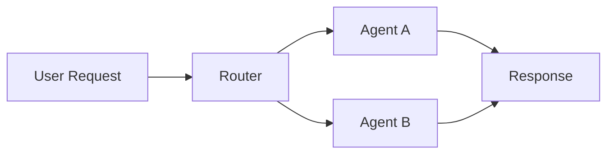

# Academic Writing Standards: Reference Guide for Practitioner Manuals

**Purpose:** Reference document for rewriting a practitioner's manual on AI agents.
Covers APA 7th citation, document structure, readability, visuals, and anti-patterns.

**Created:** 2026-03-08

---

## 1. APA 7th Edition Reference Style

APA uses the author-date system. In-text citations take the form `(Author, Year)` or
`Author (Year)`. The reference list appears at the end, alphabetized by first author's
surname. Only sources cited in the text appear in the reference list.

### General Formatting Rules

- Hanging indent: first line flush left, subsequent lines indented 0.5 inches.
- Only capitalize the first word of the title, the first word after a colon, and proper nouns.
- Italicize titles of standalone works (books, reports, journals). Do not italicize article titles.
- Include DOIs as `https://doi.org/xxxxx` (not the old `doi:` prefix).
- For URLs, do not add a period after the URL.
- Up to 20 authors: list all. 21+: list the first 19, an ellipsis, then the last author.

### Journal Article (with DOI)

**Template:**
```
Author, A. A., & Author, B. B. (Year). Title of article. Title of Periodical,
    Volume(Issue), Page–Page. https://doi.org/xxxxx
```

**Example:**
```
Grover, S., & Pea, R. (2013). Computational thinking in K–12: A review of the
    state of the field. Educational Researcher, 42(1), 38–43.
    https://doi.org/10.3102/0013189X12463051
```

**In-text:** `(Grover & Pea, 2013)` or `Grover and Pea (2013) argued that...`

### Book

**Template:**
```
Author, A. A. (Year). Title of work: Capital letter also for subtitle.
    Publisher. https://doi.org/xxxxx
```

**Example:**
```
Tufte, E. R. (2001). The visual display of quantitative information (2nd ed.).
    Graphics Press.
```

**In-text:** `(Tufte, 2001, p. 87)`

### Chapter in an Edited Book

**Template:**
```
Author, A. A. (Year). Title of chapter. In E. E. Editor (Ed.), Title of book
    (pp. xx–xx). Publisher. https://doi.org/xxxxx
```

**Example:**
```
Vaswani, A. (2017). Attention mechanisms in sequence models. In J. Smith (Ed.),
    Advances in neural information processing (pp. 112–130). MIT Press.
```

### Web Page

**Template:**
```
Author, A. A. (Year, Month Day). Title of page. Site Name.
    https://www.example.com/page
```

If the author and site name are the same, omit the site name.

**Example:**
```
World Health Organization. (2024, January 15). Mental health and COVID-19.
    https://www.who.int/mental-health-covid
```

**In-text:** `(World Health Organization, 2024)`

### Blog Post

**Template:**
```
Author, A. A. (Year, Month Day). Title of post. Blog Name.
    https://www.example.com/post
```

**Example:**
```
Miessler, D. (2025, June 14). The real risk of AI agents in production.
    Unsupervised Learning. https://danielmiessler.com/p/real-risk-ai-agents
```

**In-text:** `(Miessler, 2025)`

### YouTube Video

**Template:**
```
Author, A. A. [Screen Name]. (Year, Month Day). Title of video [Video].
    YouTube. https://www.youtube.com/watch?v=xxxxx
```

If the poster is known only by a screen name, use that as the author.

**Example:**
```
Jones, N. [NateJonesYT]. (2025, September 22). Building memory systems for
    AI agents [Video]. YouTube. https://www.youtube.com/watch?v=abc123
```

**In-text:** `(Jones, 2025)` — or if only screen name: `(NateJonesYT, 2025)`

### GitHub Repository

APA treats software and code as a reference with a bracketed description.

**Template:**
```
Author, A. A. (Year). Title of repository (Version x.x) [Source code]. GitHub.
    https://github.com/author/repo
```

**Example:**
```
LangChain Team. (2025). LangChain (Version 0.2.0) [Source code]. GitHub.
    https://github.com/langchain-ai/langchain
```

**In-text:** `(LangChain Team, 2025)`

If citing a specific release, include the version number. If citing the repo
generally, omit the version and add "Retrieved Month Day, Year" if the content
may change.

### Technical Report

**Template:**
```
Author, A. A. (Year). Title of report (Report No. xxx). Publisher.
    https://www.example.com/report
```

**Example:**
```
Anthropic. (2025). The Claude model card and evaluations (Technical Report).
    Anthropic. https://www.anthropic.com/research/claude-model-card
```

### Conference Paper / Preprint

**Template:**
```
Author, A. A. (Year). Title of paper. In Proceedings of the Conference Name
    (pp. xx–xx). Publisher. https://doi.org/xxxxx
```

For arXiv preprints:
```
Author, A. A. (Year). Title of paper. arXiv. https://arxiv.org/abs/xxxx.xxxxx
```

---

## 2. Structure of a Technical Report / Practitioner's Manual

### 2.1 Title Page

Contains the title (bold, centered, upper half of page), author name(s), affiliation,
date, and optionally a version number. For practitioner manuals, also include:
- Intended audience (e.g., "For transport logistics operators")
- Version/revision history

### 2.2 Abstract

The abstract is a single paragraph of 150–250 words that summarizes the entire document.
It answers four questions:

1. **What is this?** (purpose and scope)
2. **How was it made?** (methodology or approach)
3. **What does it contain?** (key topics and findings)
4. **Why does it matter?** (practical value to the reader)

A *structured abstract* uses labeled sections (Objective, Methods, Results, Conclusions).
An *unstructured abstract* reads as flowing prose. For practitioner manuals, unstructured
is usually better — it reads more naturally and feels less clinical.

Write the abstract last. It is the most-read part of any document.

### 2.3 Table of Contents

Auto-generated from headings. Include page numbers. For documents over 20 pages, also
include a List of Figures and List of Tables.

### 2.4 Introduction

The introduction has four jobs:

1. **Hook.** Open with a concrete problem, scenario, or surprising fact that the reader
   recognizes from their own experience. Do not open with "In recent years..."
2. **Problem statement.** Define the specific gap or need. What can the reader not do
   today? What goes wrong without this knowledge?
3. **Scope.** State explicitly what the document covers and what it does not. This
   manages expectations and prevents disappointment.
4. **Structure overview.** A brief paragraph: "Chapter 2 covers X. Chapter 3 addresses Y."
   This gives the reader a mental map.

Length: 1–3 pages depending on document size.

### 2.5 Methodology / Approach

Explain how the knowledge was gathered, tested, or validated. For a practitioner's
manual on AI agents, this might cover:
- What systems were built and tested
- What tools and APIs were evaluated
- What time period the experience covers
- What scale (number of routes, queries, users)

This section builds credibility. Without it, the reader has no way to judge whether
your recommendations are based on two weeks of tinkering or two years of production use.

### 2.6 Body Chapters

Each chapter follows this internal structure:

1. **Chapter introduction** (1–2 paragraphs): what this chapter covers, why it matters,
   and what the reader will be able to do after reading it.
2. **Sections** (3–7 per chapter): each section covers one concept or technique.
3. **Chapter summary** (1 paragraph): key takeaways, bridge to the next chapter.

Each section within a chapter follows the TEAS pattern:

- **Topic sentence:** States the main claim or concept. ("The routing algorithm
  prioritizes stops by time window, not geographic proximity.")
- **Evidence:** Data, code examples, screenshots, measurements. ("Table 3 shows
  that time-window sorting reduced missed deliveries by 34%.")
- **Analysis:** Explain what the evidence means. Why does this result matter?
  What are the implications?
- **Synthesis:** Connect back to the chapter's theme and forward to the next section.

### 2.7 Conclusion / Summary

The conclusion does three things:

1. **Recaps** the key findings (not by repeating the abstract, but by emphasizing
   the practical implications).
2. **States limitations** honestly. What was not tested? What assumptions were made?
3. **Points forward.** What should the reader do next? What are open questions?

Never introduce new information in the conclusion.

### 2.8 References / Bibliography

Follow APA 7th formatting (see Section 1). List only sources actually cited in the
text. Alphabetical by first author's surname.

### 2.9 Appendices

Use appendices for:
- Full code listings (if only snippets appear in the body)
- Raw data tables
- Configuration files
- API reference details
- Glossary of terms

Label as Appendix A, Appendix B, etc. Reference them from the body text:
"The complete configuration is provided in Appendix B."

---

## 3. Writing for Practitioners (Not Academics)

Practitioner documents have one goal: enable the reader to do something they could not
do before reading. Every paragraph must earn its place by moving toward that goal.

### 3.1 Explain Before You Use

Never use a term, acronym, or concept before defining it. The first mention of any
technical term should include a brief, plain-language definition.

Bad: "The RAG pipeline retrieves context from the vector store."
Good: "Retrieval-augmented generation (RAG) is a technique where the system searches
a database of text passages — called a vector store — before generating a response.
This allows the AI to ground its answers in specific, verified information rather than
relying solely on its training data."

After the first explanation, you can use the term freely.

### 3.2 Running Examples

Choose one concrete scenario (e.g., "a delivery route with 15 stops") and use it
throughout the document. Each chapter adds a new layer to the same example. This
gives the reader a persistent mental model to anchor abstract concepts to.

Introduce the example early: "Throughout this manual, we will follow a single delivery
route — Route 256, a morning run with 15 stops across Copenhagen — to illustrate each
concept."

### 3.3 Transition Paragraphs

Every section should end by connecting to what comes next. Every section should begin
by connecting to what came before.

Bad (abrupt):
> "...and that concludes the sorting algorithm.
> ## 4.3 Error Handling
> When an API call fails..."

Good (bridged):
> "...and that concludes the sorting algorithm. But sorted routes are only useful if the
> data feeding them is reliable — which brings us to error handling.
> ## 4.3 Error Handling
> Even the best routing algorithm produces garbage if its input data is corrupted. This
> section covers three categories of errors that the system must handle..."

### 3.4 Topic Sentences That Preview

The first sentence of every paragraph tells the reader what they will learn from
that paragraph. If a reader only read the first sentence of every paragraph, they
should get a coherent summary of the document.

Bad: "There are several things to consider here."
Good: "The routing API accepts three date formats, but only ISO 8601 produces
consistent results across time zones."

### 3.5 Concrete Before Abstract

Show the code or the example first. Then explain the principle. Practitioners learn
by recognizing patterns in concrete instances, not by deducing instances from axioms.

Bad order:
> "The observer pattern decouples event producers from consumers, allowing..."
> [three paragraphs of theory]
> "For example: `eventBus.on('route_updated', refreshDisplay)`"

Good order:
> "When a route changes, the display needs to update. Here is how the system handles
> that:
> ```javascript
> eventBus.on('route_updated', refreshDisplay)
> ```
> This single line replaces what would otherwise be a tangle of direct function calls.
> The routing module does not need to know that a display exists — it simply announces
> 'the route changed,' and any interested component responds. This is the observer
> pattern: producers emit events, consumers subscribe to them, and neither needs to
> know about the other."

### 3.6 The Inverted Pyramid

State the most important information first. Background, caveats, and edge cases come
after. This serves two purposes: busy readers get the answer immediately, and readers
who continue get progressively deeper context.

Paragraph structure:
1. **Lead:** The main point, in one sentence.
2. **Support:** Evidence, data, or example (2–3 sentences).
3. **Context:** Background, caveats, alternatives (1–2 sentences).

### 3.7 White Space and Visual Hierarchy

- Paragraphs: 4–6 lines maximum. Break longer paragraphs.
- Sentences: aim for 10–20 words. Mix short and long for rhythm.
- Headings: use 3 levels maximum (H1, H2, H3). More creates cognitive overhead.
- Line length: 45–90 characters per line (the reading comfort zone).
- Font: Serif for print (Times New Roman, Garamond). Sans-serif for screen (Calibri, Arial).
- Size: 11–12 pt body text. Never smaller than 10 pt.

### 3.8 When to Use Diagrams vs Text vs Tables vs Code

| Content type | Best format |
|---|---|
| Process with steps in sequence | Flowchart or numbered list |
| Relationships between components | Architecture diagram |
| Comparison of 3+ options | Table or comparison matrix |
| Exact syntax or configuration | Code block |
| Data with patterns across dimensions | Chart or graph |
| Decision with branching conditions | Decision tree |
| Timeline of events | Sequence diagram or timeline |
| A single concept or definition | Text paragraph |
| A list of 3–5 short items | Bullet list |

Rule of thumb: if you need more than two sentences to describe a spatial relationship,
use a diagram. If you need more than five rows to show differences, use a table.

---

## 4. Visual Elements in Technical Writing

### 4.1 When Diagrams Help vs When They Are Decoration

A diagram is justified when it shows **relationships, flow, or structure** that would
take multiple paragraphs to describe in text. A diagram is decoration when it restates
what the surrounding text already says clearly.

Test: cover the diagram and read only the text. If the text is complete without the
diagram, the diagram is decorative. If the text says "as shown in Figure 3" and the
reader genuinely needs the figure to understand, the diagram earns its place.

### 4.2 Types of Diagrams

**Architecture diagram.** Shows components and their connections. Use for system
overviews. Label every box and every arrow. Arrows should indicate direction of data
flow or dependency, not just "is related to."

**Flowchart.** Shows a process with decision points. Use for algorithms, workflows,
and troubleshooting guides. Keep to one page. If it does not fit, decompose into
sub-processes.

**Comparison matrix / table.** Compares features, tools, or options across consistent
criteria. Always include a header row. Align numbers to the right, text to the left.

**Decision tree.** Shows branching logic based on conditions. Use for "which tool
should I use" or "how do I handle this error" scenarios.

**Sequence diagram.** Shows interactions between components over time. Use for API
call chains, authentication flows, or multi-step processes.

**Concept map / mind map.** Shows hierarchical or associative relationships between
ideas. Use for domain overviews or taxonomy. Less precise than architecture diagrams.

### 4.3 Referencing Figures in Text

Every figure must be referenced in the text before it appears. The reference should
tell the reader what to look for, not just point at the figure.

Bad: "See Figure 3."
Bad: "Figure 3 shows the architecture."
Good: "The system uses three layers — ingestion, processing, and delivery — connected
by an event bus (Figure 3)."

The parenthetical reference `(Figure 3)` tells the reader where to look. The sentence
tells the reader what they are looking at and why it matters.

### 4.4 Captioning Conventions (APA Style)

Figures and tables are numbered sequentially and independently (Figure 1, Figure 2...
Table 1, Table 2...).

**Figure caption format:**
```
Figure 1
System Architecture Showing the Three Processing Layers
```
The label ("Figure 1") is bold. The title is in italic, placed below the figure, on a
new line. APA 7th places the number and title above the figure body for tables, below
for figures — but consistency matters more than convention in practitioner documents.

**Table caption format:**
```
Table 2
Comparison of Embedding Models by Cost and Performance
```

### 4.5 Tools for Creating Diagrams

**Mermaid** (for Markdown documents): Inline diagram syntax. Supported by GitHub,
GitLab, Obsidian, and most modern Markdown renderers. Best for flowcharts, sequence
diagrams, and simple architecture diagrams.



**TikZ** (for LaTeX): Full programmatic control over layout. Steep learning curve but
produces publication-quality diagrams. Best for papers and formal reports.

**draw.io / diagrams.net**: Free, browser-based. Good for complex architecture diagrams.
Exports to SVG, PNG, PDF. Integrates with VS Code.

**Excalidraw**: Hand-drawn aesthetic. Good for informal diagrams, sketches, whiteboard
explanations.

---

## 5. Common Anti-Patterns in Technical Writing

### 5.1 Bullet-Point-Itis

The most pervasive anti-pattern. Lists are easy to write but hard to read at scale.
A document that is 80% bullet points has no narrative — the reader gets fragments
without connections between them.

Bullets are appropriate for:
- Short reference lists (3–7 items)
- Checklists
- Feature lists where order does not matter

Bullets are inappropriate for:
- Explanations (use paragraphs)
- Arguments (use flowing prose with evidence and reasoning)
- Tutorials (use numbered steps with explanatory text between them)

If your section is more than 50% bullets, rewrite it as prose.

### 5.2 "See X for Details"

This phrase pushes cognitive load onto the reader. Instead of sending them elsewhere,
provide a self-contained explanation and optionally reference the detailed source.

Bad: "For authentication details, see the API documentation."
Good: "Authentication uses OAuth 2.0 with client credentials. The system requests a
token from the /auth/token endpoint using the API key and secret, then includes the
token as a Bearer header in subsequent requests. The full specification is documented
in the API Reference (Appendix C)."

### 5.3 Assuming Reader Knowledge

Never assume the reader knows what you know. Establish shared context before building
on it. A useful heuristic: imagine the reader is a competent professional in an adjacent
field. They are intelligent but unfamiliar with your specific domain.

### 5.4 Jargon Without Definition

Every domain has jargon. Jargon is efficient among insiders and exclusionary to everyone
else. Define terms on first use. Consider a glossary in an appendix for documents with
more than 20 technical terms.

Bad: "The LLM hallucinates when the retrieval pipeline returns low-relevance chunks."
Good: "Large language models (LLMs) sometimes generate plausible but incorrect
information — a failure mode known as hallucination. This happens more frequently when
the retrieval pipeline — the system that searches for relevant text passages to include
in the prompt — returns passages that are only weakly related to the question."

### 5.5 Claims Without Evidence

Every factual claim needs a source, a measurement, or a concrete example. Unsupported
claims read as opinion.

Bad: "AI agents significantly improve productivity."
Good: "In our deployment, the routing agent reduced manual scheduling time from 45
minutes to 8 minutes per route — an 82% reduction measured over 30 working days
(see Table 4)."

### 5.6 Missing Transitions

Sections that start without connecting to the previous section feel like a new
document. The reader has to rebuild context from scratch. A single transition sentence
at the start of each section eliminates this problem (see Section 3.3).

---

## 6. Converting Bullet Points into Flowing Prose

This is the single most important skill for rewriting a practitioner manual. Most
drafts are written as bullet points because bullets are fast to write. The revision
process turns those bullets into readable, connected prose.

### 6.1 The Method

**Step 1: Write a topic sentence that frames the list.**

The topic sentence replaces the heading-as-summary. It tells the reader what the
following paragraphs will cover and why the content matters.

Bullets:
```
- Supports 3 date formats
- ISO 8601 is most reliable
- Legacy format causes timezone bugs
```

Topic sentence: "The API accepts three date formats, but only one of them produces
reliable results across time zones."

**Step 2: Expand each bullet into a paragraph.**

Each bullet becomes a paragraph with three parts:

- **Claim:** What is true? (The bullet's content, stated as a complete sentence.)
- **Evidence:** How do we know? (A code example, measurement, or reference.)
- **Implication:** Why does it matter? (What should the reader do differently?)

Example expansion of the second bullet:

> "ISO 8601 (`2025-03-08T14:30:00+01:00`) is the only format that encodes the time
> zone offset explicitly. When the system receives a timestamp in ISO 8601, it can
> convert to UTC unambiguously. In testing, routes scheduled with ISO 8601 timestamps
> had zero time-zone-related errors over a 60-day period (Table 5). All new integrations
> should use ISO 8601 exclusively."

**Step 3: Add transitions between paragraphs.**

Use transitional phrases that show the relationship between ideas:

| Relationship | Phrases |
|---|---|
| Addition | Furthermore, In addition, Building on this |
| Contrast | However, In contrast, Despite this |
| Cause-effect | As a result, Consequently, This means that |
| Example | For instance, To illustrate, Consider |
| Sequence | First... Next... Finally |
| Summary | In summary, The key point is, To recap |

**Step 4: Add a concrete example for every abstract concept.**

If a paragraph states a principle without showing it in action, add an example.
The example should be specific (real file names, real API endpoints, real numbers)
rather than generic ("for example, a typical use case might involve...").

### 6.2 Before and After

**Before (bullet-point draft):**
```
## Route Optimization
- System sorts stops by time window
- Uses Google OR-Tools for TSP
- Fallback to greedy nearest-neighbor if OR-Tools timeout
- Reduces drive time by ~20%
- Must re-sort when new stops added mid-route
```

**After (flowing prose):**

> ## Route Optimization
>
> The routing system sorts delivery stops by their time windows — the interval during
> which each customer expects their delivery — rather than by geographic proximity.
> This distinction matters because a geographically optimal route often violates time
> constraints, leading to missed windows and customer complaints.
>
> The optimization engine uses Google OR-Tools to solve the underlying travelling
> salesman problem (TSP). OR-Tools evaluates thousands of possible stop orderings and
> selects the one that minimizes total drive time while respecting every time window.
> For Route 256, this typically produces a sequence that reduces total drive time by
> approximately 20% compared to the dispatcher's manual ordering (see Table 6 for
> measured results over 30 days).
>
> However, OR-Tools has a 5-second computation budget. If the number of stops or
> constraints exceeds what can be solved in that time, the system falls back to a
> greedy nearest-neighbor algorithm. This fallback produces routes that are 5–10%
> longer than optimal but are computed in under 100 milliseconds.
>
> One complication is mid-route changes. When a new stop is added after the route has
> begun, the system must re-optimize the remaining stops without disrupting deliveries
> already in progress. Section 5.2 covers this re-sorting mechanism in detail.

---

## 7. Quick Reference Checklist

Before submitting any section, verify:

- [ ] Every technical term is defined on first use.
- [ ] Every claim has evidence (data, source, or example).
- [ ] Every section starts with a topic sentence that previews the content.
- [ ] Every section ends with a transition to the next.
- [ ] Bullet lists are used only for short reference items, not for explanations.
- [ ] Figures are referenced in text before they appear.
- [ ] Code examples appear before the principle they illustrate.
- [ ] Paragraphs are 4–6 lines maximum.
- [ ] The running example (Route 256 or equivalent) appears at least once per chapter.
- [ ] All sources are cited in APA 7th format.

---

## Sources

- [APA 7th Edition Reference Examples (PDF)](https://apastyle.apa.org/instructional-aids/reference-examples.pdf)
- [APA Citation Style Guide — UMGC Library](https://libguides.umgc.edu/apa-examples)
- [YouTube Video Citation — GWU Himmelfarb Library](https://guides.himmelfarb.gwu.edu/APA/av-youtube-video)
- [How to Cite a GitHub Repo — Akowe](https://useakowe.com/en/citation-sources/apa/github-repository)
- [Technical Writing Standards — USU Engineering Writing Center](https://engineering.usu.edu/students/ewc/writing-resources/technical-writing-standards)
- [How to Write a Technical Manual — ProProfs](https://www.proprofskb.com/blog/write-technical-manual/)
- [Technical Writing: A Comprehensive Guide (2026)](https://www.adoc-studio.app/blog/technical-writing-guide)
- [APA 7th Edition Citation Guide — Penn State Libraries](https://guides.libraries.psu.edu/apaquickguide)
